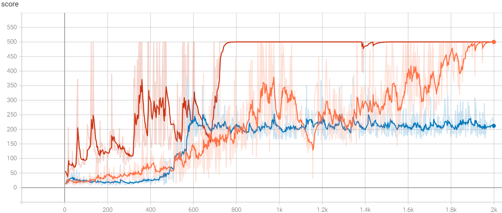
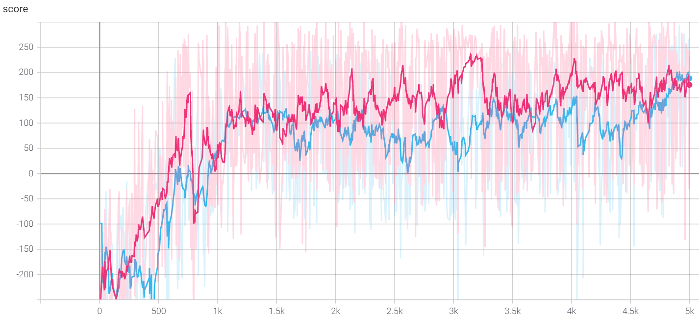
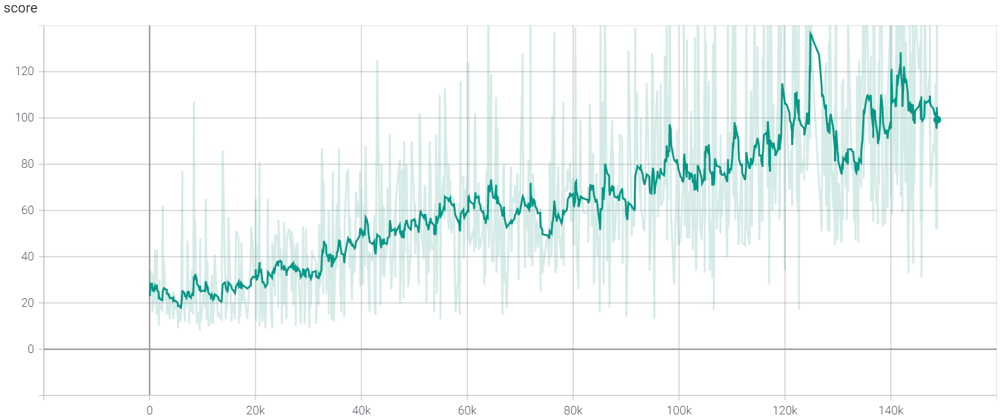

# Reinforcement Learning with Gym
Implementation of multiple reinforcement learning algorithms with gym environment

## Setup
1. Install python3 and pip3
2. Install [Pytorch](https://pytorch.org/) and [gym](https://github.com/openai/gym)
3. Install [CUDA toolkit](https://docs.nvidia.com/cuda/cuda-quick-start-guide/index.html) if the system supports hardware acceleration

## How To Use
1. Execute files in **main** directory to run reinforcement learning model
	1. Files are named **(environment)_(algorithm).py**
	2. Files include hyperparameters tuned for each environments and algorithms
2. Use **load_timestamp** parameter to resume aborted sessions
	1. The parameter can be found in **main()** function of each files mentioned above
	2. The parameter is given in a string with **%y%m%d-%H%M** format (e.g., 210101-0000)
3. Implementations of algorithms can be found in corresponding folders
	1. files in **main** directory calls function in corresponding folders
3. Execute command **tensorboard --logdir=./runs** to monitor logs
	1. By default, logs can be monitored via url **http://localhost:6006/** in a preferred web browser

## Results

CartPole
-  DQN
-  A2C
-  PPO

LunarLander
-  A2C
-  PPO

CartPole With 2D Image Inputs

-  PPO
